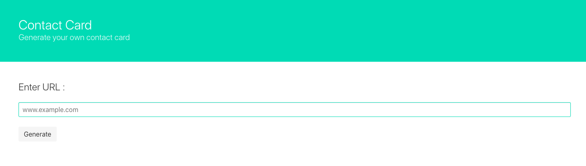
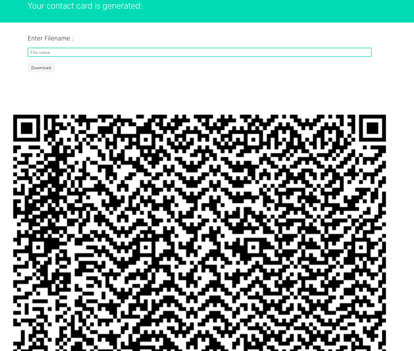

## About this project.

This project explores a single usecase of QR code - creating your contact information. You may store simple textual information about yourself or add a link that redirects to your bio in LinkedIn/twitter/facebook/personal website.

## Installation and Configuration

**Make directory called contact_card.**

    $ mkdir ap_reporting

`**cd**` **into contact_card**

    $ cd ap_reporting

**Clone this repository.**

    $ git clone {url} 

**Make** `**virtualenv**` **for this repo.**
Inside your contact_card directory

    $ virtualenv --python=`which python` env
    $ source env/bin/activate

**Install all the dependencies.**

    (env) $ pip install -r requirements.txt

**Run the project**
    (contact_card) $ gunicorn --bind=0.0.0.0:5000 wsgi:app
